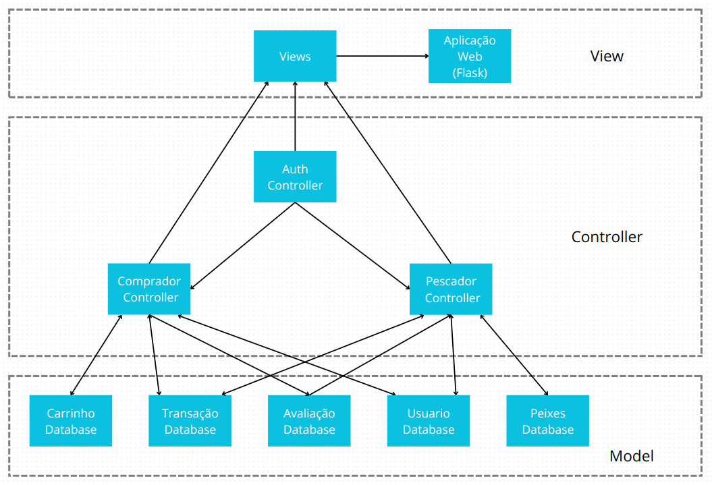

# Projeto
Aplicativo de compra e venda de peixes pescados localmente para fomentar o comércio em pequena escala e promover o consumo consciente.

# Descrição da Arquitetura
Para a implementação do projeto foi utilizado o estilo Model View Controller (MVC) na elaboração da arquitetura, de modo que os componentes da aplicação fiquem separados em grupos: model (classes, objetos e banco de dados), view (responsável por mostrar as telas aos usuários, o framework Flask utilizado se enquadra nesse grupo) e Controller (responsável por controlar a aplicação, lida com a lógica por trás das funcionalidades da aplicação).
Segue o diagrama em nivel de componentes (C4 - Nível 3), dos componentes do projeto:

## Principais Componentes 

### Componentes do Model:
 Composto por basicamente cinco componentes, responsáveis por serem os modelos de dados e serviços da aplicação, são eles:
 * Carrinho Database: modela e armazena os dados no carrinho de compras do usuário comprador.
 * Transação Database: modela e fornece os serviçoes de compra e venda dentro da aplicação.
 * Avaliação Database: modela e armazena as notas e comentários dadas pelos usuários compradores para os usuários vendedores.
 * Usuário Database: modela e armazena as informações dos usuários da plataforma.
 * Peixes Database: modela e armazena as informações relativas aos produtos vendidos pelos pescadores: peixes.

### Componentes do View:
 Composto por basicamente um componente (Views) que faz a comunicação com o framework Flask para promover a visualização das telas para os usuários.

 Além disso, para a construção desse componente foi utilizado o padrão de projeto Singleton, cuja implementação baseia-se na instanciação unica desse objeto de modo que todos os componentes que o utilizam, utilizam a mesma instancia do objeto.

### Componentes do Controller:
 Composto por três componentes, responsáveis por controlar o fluxo da aplicação, são eles:
 * Auth Controller: responsável por controlar a lógica por trás das telas e da autenticação dos usuários.
 * Comprador Controller: responsável por controlar a lógica por trás das telas e ações dos usuários do tipo Comprador.
 * Pescador Controller: responsável por controlar a lógica por trás das telas e ações dos usuários do tipo Pescador.